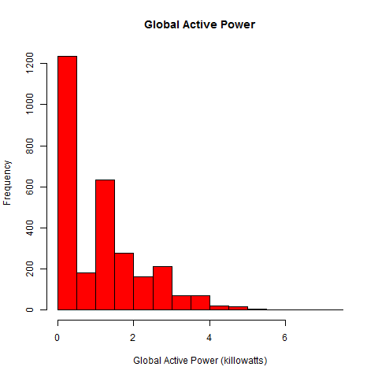
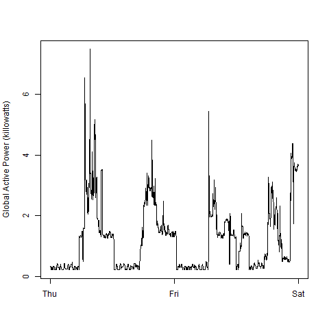

## Coursera - Exploratory Data Analysis
### Project #1 - Individual household electric power consumption Data Set

This is the repo for the first Course Project required by "Exploratory Data Analysis" Course taken at Coursera. This work used data about individual household electric power consumption, measured in one household with 1-min sampling rate during almost 4 years.

Data source:
"https://archive.ics.uci.edu/ml/datasets/Individual+household+electric+power+consumption"

The aim of this activity is to reproduce some plots as described at "https://github.com/rdpeng/ExData_Plotting1".

The script dataPreparation.R could be used to download and subset the required data. An alternative is given on the four plot scripts (plot_.R) by downloading a already tidy data file (data2Project1.txt).

The produced plots are showed below:

 

